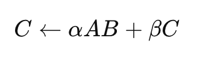
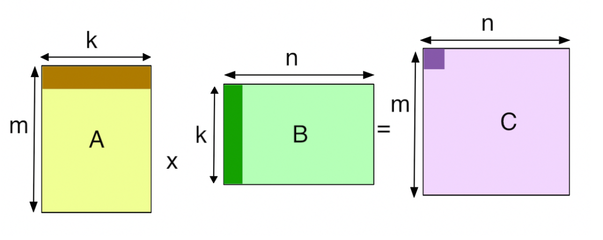

> 这篇文档是安装了 CUTLASS 后第一个自己完成的代码 DEMO。同时也可以用来检验配置是否正确。
>
> 通过本节，你可以学到：
>
> 1. GEMM 是什么
> 2. 矩阵排列方式和数据类型
> 3. 如何调用 CUTLASS 完成一个简单的 GEMM， 包含 DEVICE 和 CPU 两部分
> 4. 如何使用 CUTLASS 生成张量数据
>
> **配套代码示例**：[code/02_simple_gemm](../code/02_simple_gemm)

## 背景：矩阵乘法
矩阵乘法 GEMM（General Matrix Multiply）是基本线性代数子程序（BLAS）库中的一个核心函数，用于执行矩阵乘法运算。

涉及参数有：稠密矩阵A、B和C，以及标量alpha和beta。



其中

+ A 是 m×k 矩阵，
+ B 是 k×n 矩阵，
+ C 是 m×n 矩阵，
+ α, β 为标量。

时间复杂度：O(m⋅n⋅k)。

### CPU 伪代码
下面是 CPU 伪代码实现：

```python
# 输入：A[m][k], B[k][n], C[m][n], scalars alpha, beta
for i in 0 .. m-1:
    for j in 0 .. n-1:
        C[i][j] = beta * C[i][j]      # 可选：如果 beta==0 则设为 0
        sum = 0
        for p in 0 .. k-1:
            sum = sum + A[i][p] * B[p][j]
        C[i][j] = C[i][j] + alpha * sum
```

### CUDA GPU 优化
本节将会介绍一些简单的 GPU 优化 GEMM 过程的思路。如果只想了解 CUTLASS 如何实现简单矩阵乘法，请跳过这节。

1. **分块**：为了实现并行处理，我们对一个大矩阵进行分块，每次使用 GPU 的一部分执行单元来做小块的矩阵乘法，再合并最终结果，就可以利用好 GPU 的并行性。
2. **共享内存缓存**：由于 A 矩阵和 B 矩阵在相乘时，计算 A 的某一块和 B 的某若干个块的乘积时，可以事先缓存矩阵 A， 从而减少 GPU 访存量，从而提高性能。同样的，也可以缓存 B 的矩阵块。
3. **常规 CUDA 优化手段**：减少 BANK 冲突、寄存器重用、合并访存、使用 Tensor Core加速。

### 行列主序 和 Leading Dimension
#### 行主序、列主序
+ 由于传入 CUDA Kernel 的参数类型为**一个指针**，因此矩阵会被一维连续存储。

**行/列主序** 指矩阵元素存储的顺序。如果先保存第一行的从左到右的所有元素，然后保存第二行的元素，以此类推，则为行主序。按照列优先保存则为列主序。

#### Leading Dimension
为了让算子知道如何索引行主序的下一行（或者列主序的下一列）在哪里，需要一个参数描述行主序的行跨度有多大（同时也是列主序的列跨度），这个值就是**Leading Dimension**。

下图表示了一个经典的** M N K **尺寸的 **GEMM**。

+ 对于矩阵 **A** ：如果为行主序，那么 **Leading Dimension = k**
+ 对于矩阵 **A** ：如果为列主序，那么 **Leading Dimension = m**
+ 对于矩阵 **B**：如果为行主序，那么 **Leading Dimension = n**
+ 对于矩阵 **B**：如果为列主序，那么 **Leading Dimension = k**
+ 对于矩阵 **C**：如果为行主序，那么 **Leading Dimension = n**
+ 对于矩阵 **C**：如果为列主序，那么 **Leading Dimension = m**



+ 总结：**行主序**的** Leading Dimension **为**总列数**。**列主序**的** Leading Dimension** 为**总行数**。

## 背景：模版化编程 templates
这节介绍 **templates **特性。如果是经验丰富的 C++ 程序员或者熟悉这样的特性，请跳过此节。

### C++ 模板
**C++ 模板（templates）是一种编译期泛型机制**，允许用同一套代码生成针对不同数据类型或配置的专门版本。  
比如：

```plain
template <typename T>
T add(T a, T b) {
    return a + b;
}
```

+ `add<int>(1, 2)` 会实例化出一个 `int add(int,int)` 版本
+ `add<float>(1.0f, 2.0f)` 会实例化出一个 `float add(float,float)` 版本

模板支持 **类型参数**、**值参数** 和 **策略类（policy classes）** 等，用于高度灵活的代码生成。

### CUTLASS 中模板的运用
如 GEMM 这样的算子的性能依赖很多"组合因素"：

+ 数据类型（`float`, `double`, `half`, `int8`…）
+ 矩阵布局（row-major / column-major）
+ tile 大小（线程块、warp、线程级 tile）
+ 是否使用 Tensor Core
+ 是否需要 epilogue 操作（如加偏置、ReLU）

如果为每种组合都手工写一个 kernel，代码会爆炸。  
CUTLASS 用 **模板元编程**来把这些因素作为模板参数：

```plain
cutlass::gemm::device::Gemm<
    float, cutlass::layout::RowMajor, 
    float, cutlass::layout::ColumnMajor,
    float, cutlass::layout::RowMajor
> my_gemm;
```

这样，编译器会根据参数生成特定配置的 GEMM kernel。

## 编写 GEMM Kernel
以下的代码均默认为 GPU Kernel，不包含 CPU 主机端部分。

### CUTLASS API
让我们看看 CUTLASS 中怎么启动一次 GEMM 操作：

```cpp
// 定义CUTLASS GEMM模板类型，指定所有矩阵的数据类型和布局
using CutlassGemm = cutlass::gemm::device::Gemm<float,        // 矩阵A的数据类型
                                              ColumnMajor,  // 矩阵A的布局（列主序）
                                              float,        // 矩阵B的数据类型
                                              ColumnMajor,  // 矩阵B的布局（列主序）
                                              float,        // 矩阵C的数据类型
                                              ColumnMajor>; // 矩阵C的布局（列主序）
// 下面会调用的这个算子
CutlassGemm gemm_operator;
```

这里传入了模板参数，指明了以下的内容：

+ **A** 和 **B** 矩阵的数据类型：这里使用 **float** 类型。还可以使用如： **double half_t bfloat16_t tfloat32_t** 等。请参考 **附录1** 。如果该类型不是 C++ 原生数据类型，使用时需要使用 **cutlass namespace**，如 **cutlass::half_t**。
+ **A 和 B** 矩阵的数据存储顺序。这里使用 **列主序**。**列主序**是 **BLAS** 计算的默认存储方式，适合列访问结构。你也可以选择使用**行主序 RowMajor** 等。关于矩阵布局的说明，请参考 **附录2**。

---

好了。下面我们需要传入指定的参数给算子，然后进行计算。

```cpp
// 调用GEMM操作符，传入参数对象
// 参数对象包含问题维度、矩阵引用和标量系数
CutlassGemm::Arguments args(
    {M , N, K},    // GEMM问题维度
    {A, lda},      // 源矩阵A的张量引用
    {B, ldb},      // 源矩阵B的张量引用
    {C, ldc},      // 源矩阵C的张量引用
    {C, ldc},      // 目标矩阵D的张量引用（可能与源C矩阵使用不同的内存）
    {alpha, beta}  // 在Epilogue中使用的标量
);
```

为什么是这样传入参数的？

+ CUTLASS 的设计模式之一是定义 **可在主机代码中构造 **并通过值传递给内核的 GEMM 参数对象。这些可能包括指针、步长、标量以及 GEMM 及其组件所需的其他参数。
+ 这种模式的 **好处 **是：用于将主机可构造参数传递给内核的结构化、可组合策略 和 最小化内核入口处的初始化开销。

---

下面，启动内核：

```cpp
// 调用GEMM操作符，传入构造好的参数对象
cutlass::Status status = gemm_operator(args);
```

然后可以对返回状态进行判断得知操作是否成功。

---

有了上面的 API 逻辑，我们编写的 Kernel 应该如下面这样：

```cpp
/// 定义CUTLASS GEMM模板并启动GEMM内核
/// 参数说明：
/// M, N, K: 矩阵维度，计算 C = alpha * A * B + beta * C，其中A是M×K，B是K×N，C是M×N
/// alpha, beta: 标量系数
/// A, B, C: 矩阵数据指针
/// lda, ldb, ldc: 矩阵的leading dimension（列主序布局下的行数）
cudaError_t CutlassSgemmNN(
  int M,              // 矩阵A的行数，矩阵C的行数
  int N,              // 矩阵B的列数，矩阵C的列数
  int K,              // 矩阵A的列数，矩阵B的行数
  float alpha,        // 标量系数alpha
  float const *A,     // 输入矩阵A的指针
  int lda,            // 矩阵A的leading dimension
  float const *B,     // 输入矩阵B的指针
  int ldb,            // 矩阵B的leading dimension
  float beta,         // 标量系数beta
  float *C,           // 输入/输出矩阵C的指针
  int ldc) {          // 矩阵C的leading dimension

  // 定义单精度CUTLASS GEMM的类型定义，使用列主序输入矩阵和128x128x8线程块瓦片大小（默认选择）
  //
  // 为了保持接口的可管理性，为合理的组合定义了几个辅助函数，包括以下单精度GEMM示例。
  // 使用典型值作为默认模板参数。更多详细信息请参阅`cutlass/gemm/device/default_gemm_configuration.h`
  //
  // 要查看完整的gemm设备API接口，请参阅`cutlass/gemm/device/gemm.h`

  // 定义列主序布局类型别名
  using ColumnMajor = cutlass::layout::ColumnMajor;

  // 定义CUTLASS GEMM模板类型，指定所有矩阵的数据类型和布局
  using CutlassGemm = cutlass::gemm::device::Gemm<float,        // 矩阵A的数据类型
                                                  ColumnMajor,  // 矩阵A的布局（列主序）
                                                  float,        // 矩阵B的数据类型
                                                  ColumnMajor,  // 矩阵B的布局（列主序）
                                                  float,        // 矩阵C的数据类型
                                                  ColumnMajor>; // 矩阵C的布局（列主序）

  // 定义CUTLASS GEMM操作符实例
  CutlassGemm gemm_operator;

  // 构造CUTLASS GEMM参数对象
  //
  // CUTLASS的设计模式之一是定义可在主机代码中构造并通过值传递给内核的gemm参数对象。
  // 这些可能包括指针、步长、标量以及Gemm及其组件所需的其他参数。
  //
  // 这种模式的好处是：(1) 用于将主机可构造参数传递给内核的结构化、可组合策略
  // 和 (2) 最小化内核入口处的初始化开销。
  //
  CutlassGemm::Arguments args({M , N, K},  // GEMM问题维度
                              {A, lda},    // 源矩阵A的张量引用
                              {B, ldb},    // 源矩阵B的张量引用
                              {C, ldc},    // 源矩阵C的张量引用
                              {C, ldc},    // 目标矩阵D的张量引用（可能与源C矩阵使用不同的内存）
                              {alpha, beta}); // 在Epilogue中使用的标量

  //
  // 启动CUTLASS GEMM内核
  //
  
  // 调用GEMM操作符，传入构造好的参数对象
  cutlass::Status status = gemm_operator(args);

  //
  // 如果CUTLASS GEMM操作符返回错误代码，则返回cudaError_t
  //

  if (status != cutlass::Status::kSuccess) {
    return cudaErrorUnknown;  // 返回未知CUDA错误
  }

  // 如果没有遇到错误，返回成功
  return cudaSuccess;
}
```

## CPU GEMM
CUTLASS 也为 CPU 实现提供了接口，只需要在主机端函数调用即可，如下：

```cpp
// 使用主机端GEMM参考实现计算参考结果
  cutlass::reference::host::Gemm<
    cutlass::half_t,                           // 矩阵A的元素类型
    cutlass::layout::ColumnMajor,              // 矩阵A的布局
    cutlass::half_t,                           // 矩阵B的元素类型
    cutlass::layout::ColumnMajor,              // 矩阵B的布局
    cutlass::half_t,                           // 输出矩阵的元素类型
    cutlass::layout::ColumnMajor,              // 输出矩阵的布局
    cutlass::half_t,                           // 内部累加类型
    cutlass::half_t                            // 标量类型
  > gemm_ref;

// 调用主机端参考GEMM实现
  gemm_ref(
    {M, N, K},                          // 问题大小（类型：cutlass::gemm::GemmCoord）
    alpha,                              // alpha（类型：cutlass::half_t）
    A.host_ref(),                       // 矩阵A（类型：TensorRef<half_t, ColumnMajor>）
    B.host_ref(),                       // 矩阵B（类型：TensorRef<half_t, ColumnMajor>）
    beta,                               // beta（类型：cutlass::half_t）
    C_reference.host_ref()              // 矩阵C（类型：TensorRef<half_t, ColumnMajor>）
  );
```

其实现和 GPU 端十分相似，这里就不再详细解释。**A.host_ref() **表示取矩阵的主机端引用（设备端可以用.device_view）。下面也会介绍对应的数据结构如何在主机端和设备端进行拷贝传输。

## 一些工具
### 如何定义一个 CUTLASS 矩阵（张量）？
本文目前只介绍 **HostTensor**。其他数据结构将在用到时再进行介绍。

+ 定义接受模板参数，包含数据类型和矩阵布局。**cutlass::MatrixCoord(K, N) **指定了矩阵大小。

```cpp
// K×N的半精度矩阵B
  cutlass::HostTensor<cutlass::half_t, 
                      cutlass::layout::ColumnMajor> B(cutlass::MatrixCoord(K, N));
```

### 如何拷贝数据？
+ 假设我有矩阵 **host_tensor**，如果从设备端拷贝到主机端或者主机端拷贝到设备端？

```cpp
// 从主机端同步到设备端
host_tensor.sync_device();
// 从设备端同步到主机端
host_tensor.sync_host();
```

+ 如果从设备端数据结构互相拷贝？

```cpp
// 把数据从 C_cutlass 拷贝到 C_reference
cutlass::device_memory::copy_device_to_device(
    C_reference.device_data(),    // 目标设备内存
    C_cutlass.device_data(),      // 源设备内存
    C_cutlass.capacity());        // 复制的字节数
```

### 如何比较 Tensor？
+ 可以使用 **cutlass::reference::host::TensorEquals** 比较两个 Tensor

```cpp
if (!cutlass::reference::host::TensorEquals(
        C_reference.host_view(),
        C_cutlass.host_view()))
    {
    
    }
```

+ 需要注意，这样的比较需要数值相等。假设其中一个张量有精度损失，则返回比较失败。

### 如何生成数据？
+ 可以为矩阵填充指定顺序，如高斯分布：

```cpp
// 任意RNG种子值。硬编码以确保确定性结果
uint64_t seed = 2080;

// 高斯随机分布参数
cutlass::half_t mean = 0.0_hf;      // 均值
cutlass::half_t stddev = 5.0_hf;    // 标准差

// 指定二进制小数点右侧允许非零的位数
// 值为"0"会将随机值截断为整数
int bits_less_than_one = 0;
// 使用设备端随机填充函数初始化矩阵A
cutlass::reference::device::TensorFillRandomGaussian(
    A.device_view(),        // 矩阵A的设备视图
    seed,                   // 随机种子
    mean,                   // 均值
    stddev,                 // 标准差
    bits_less_than_one     // 精度控制
);
```

## 实践：完成自定义 GEMM 程序
请完成一个 CUTLASS GEMM 程序。下面是要求：

+ 使用高斯分布初始化矩阵 A 和 B。
+ 调用主机端和设备端 GEMM 函数计算结果。
+ 对比结果是否正确。


