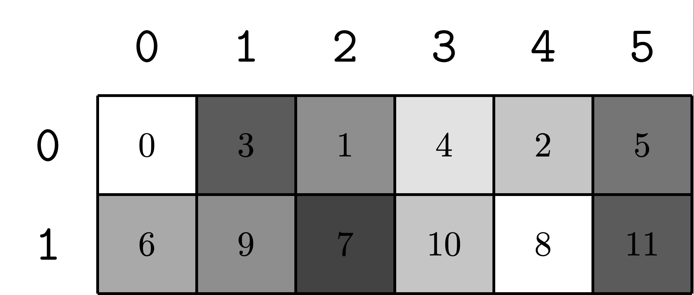

> CuTe 是处理多维数据（Tensor）的模板抽象。学会了 CuTe 之后，你将会描述不同情形下的多维矩阵，而不需要关注矩阵内部具体元素的存取位置细节等，从而利用 CUTLASS 的相关特性。
>
> **配套代码示例**：[code/03_cute_layout](../code/03_cute_layout)

## 环境要求
+ CUTLASS 3.x
+ NVCC with C++ 17

## 配置说明
+ **CuTe** 是一个仅 **header** 的库。你可以在 CUTLASS 的 **include/** 文件夹下找到。
+ 参考例子在 **CUTLASS** 目录下 **examples/cute/** 内。

## 引入 CuTe
+ 关键组件如下：

| 目录 | 内容 |
| --- | --- |
| [include/cute](https://github.com/NVIDIA/cutlass/tree/main/include/cute) | 每个 header 对应于 CuTe 的基本组件之一，如 [Layout](https://github.com/NVIDIA/cutlass/tree/main/include/cute/layout.hpp) 和 [Tensor](https://github.com/NVIDIA/cutlass/tree/main/include/cute/tensor.hpp)。 |
| [include/cute/container](https://github.com/NVIDIA/cutlass/tree/main/include/cute/container) | 实现类似 STL 的对象，如元组、数组和对齐数组。 |
| [include/cute/numeric](https://github.com/NVIDIA/cutlass/tree/main/include/cute/numeric) | 基本数字数据类型，包括非标准浮点类型、非标准整数类型、复数和整数序列。 |
| [include/cute/algorithm](https://github.com/NVIDIA/cutlass/tree/main/include/cute/algorithm) | 实用程序算法的实现，如 copy, fill, clear。 |
| [include/cute/arch](https://github.com/NVIDIA/cutlass/tree/main/include/cute/arch) | 特定架构的矩阵乘法和复制指令的 wrapper。 |
| [include/cute/atom](https://github.com/NVIDIA/cutlass/tree/main/include/cute/atom) | arch/ 目录的元信息和切分、分块等工具。 |


## 数据类型
### 整数类型
CuTe 提供了 **动态** 和 **静态** 整数类型。

| 特性 / 维度 | 动态整数 (run-time integer) | 静态整数 (compile-time integer) |
| --- | --- | --- |
| C++ 类型表示 | 普通整型，如 `int`, `size_t`, `uint16_t` | `std::integral_constant<Value>` 或 CuTe 的 `cute::C<Value>` / `Int<Value>` |
| 值确定时间 | 运行时才知道 | 编译时已知常量 |
| 与运算交互 | 与静态整数混用；大多数算术运算在运行时执行 | 支持重载算术操作，静态整数运算在编译期折叠为静态整数 |
| trait / 类型判断 | `cute::is_std_integral<T>` 为真；`cute::is_integral<T>` 为真 | `cute::is_static<T>` 为真；`cute::is_integral<T>` 为真；也可用 `cute::is_constant<N, T>` 判断 |
| 占用 / 存储 | 即时值，占用常规模板变量或内存 | 通常为空类型，不占运行时存储（作为类型参数） |
| 应用场景 | 尺寸 / 维度在运行时才知道的情形 | Tile 大小 / 固定维度 / 模板参数等已知常量场景 |
| 可互换性 | 在多数 CuTe 接口中可替换为静态整数 | 同样可以混用成动态整数（转换为普通整型） |


### 元组 (Tuple)
+ `cute::tuple`：CuTe 提供的元组类型，可在设备（CUDA kernel）和主机端使用，行为类似 `std::tuple`，但对模板参数种类有一定限制以便生成更高效代码。  
+ `IntTuple`：CuTe 定义为“要么是一个整数（动态 / 静态），要么是一个 `tuple`，其每个元素又是 `IntTuple`。通过这个递归定义，CuTe 能表示嵌套结构的维度 / 形状 / 步幅等。  
+ `IntTuple` 的操作包括：`rank(...)`（元素个数），`get<I>(...)`（访问第 I 个元素），`depth(...)`（嵌套深度），`size(...)`（所有整数乘积）等。  
+ `Shape`、`Stride`、`Coord` 等在 CuTe 中都被定义为 `IntTuple` 的别名或实例。

---

#### 示例
下面是一个简单的例子，展示如何用 `cute::tuple` / `make_tuple` 构造一个嵌套的 `IntTuple`，以及如何访问其中的元素：

```cpp
#include <iostream>
#include "cutlass/experimental/cute/container/tuple.hpp"
using namespace cute;

int main() {
  // 一个简单的 IntTuple：动态整数 + 静态整数的组合
  auto t = make_tuple(int{2}, Int<3>{});
  // t 表示 (2, 3)

  // 嵌套结构：第三个元素又是一个 tuple
  auto nested = make_tuple(uint16_t{42},
                           make_tuple(Int<1>{}, int{3}),
                           Int<17>{});
  // nested 表示 (42, (1, 3), 17)

  // 访问元素 使用 get<index>()
  auto e0 = get<0>(nested);           // e0 是 uint16_t{42}
  auto e1 = get<1>(nested);           // e1 是 the tuple (Int<1>, int{3})
  auto e1_1 = get<1>(e1);              // e1_1 是 int{3}
  auto e2 = get<2>(nested);            // e2 是 Int<17>

  std::cout << "e0 = " << int(e0) << "\n";          // 注意可能要转换为 int 打印
  std::cout << "e1.second = " << int(e1_1) << "\n";
  std::cout << "e2 (static) = " << Int<17>{}.value << "\n";

  return 0;
}
```

## 布局 (Layout)
布局 `Layout` 是一对 `IntTuple`：`Shape` 和 `Stride`。第一个元素定义了 `Layout` 的抽象_形状_，第二个元素定义了_步长_，从形状内的坐标映射到索引空间。

我们在 `Layout` 上定义了许多类似于 `IntTuple` 上定义的操作。

+ `rank(Layout)`：`Layout` 中的模式数量。相当于 `Layout Shape` 的元组的 `Size`。
+ `get<I>(Layout)`: `Layout` 的第 `I` 个布局模式， `I < rank`。
+ `depth(Layout)`：`Layout` 形状的深度。单个整数的深度为 0，整数元组的深度为 1，整数元组的深度为 2，等等。
+ `shape(Layout)`：`Layout` 的**形状**。
+ `stride(Layout)`：`Layout` 的**步长**。
+ `size(Layout)`：`Layout` 函数域的大小。等同于 `size(shape(Layout))`。
+ `cosize(Layout)`：`Layout` 函数协域的大小（不一定是范围）。相当于 `A(size(A)-1)+1`。这个属性，实际上代表了从 **stride** 推理得到的实际上矩阵占用空间。

### 构造布局
+ 构造传入 **shape** 和 **stride**。如果不传入 **stride**，则为默认 **LayoutLeft**。
+ **LayoutLeft** 为从左到右解释 **shape**（列主序）。**LayoutRight** 为从右到左解释 **shape**（行主序）。
+ 这里的关键是理解嵌套的 **Layout**，内层 **Layout** 展开后作为整体。

```cpp
// 一维：大小为 8（静态）
Layout s8 = make_layout(Int<8>{});   
// 等价于 [8]，stride = [1]，编译期常量的一维数组

// 一维：大小为 8（动态）
Layout d8 = make_layout(8);  
// 等价于 [8]，stride = [1]，运行时指定大小


// 二维：2 x 4，静态维度（默认列主序）
Layout s2xs4 = make_layout(make_shape(Int<2>{}, Int<4>{}));  
// shape = [2,4]，stride = [1,2]（列主序 ColumnMajor）
// 内存顺序：先存同一列，再存下一列


// 二维：2 x 4，混合静态和动态维度
Layout s2xd4 = make_layout(make_shape(Int<2>{}, 4));  
// shape = [2,4]，stride = [1,2]，与 s2xs4 等价，只是第二维是动态 int


// 指定 stride 的二维布局
Layout s2xd4_a = make_layout(make_shape(Int<2>{}, 4),
                             make_stride(Int<12>{}, Int<1>{}));  
// shape = [2,4], stride = [12,1]
// 每行之间跨度为 12，实际每行后多留 8 个空位


// 指定列主序（LayoutLeft）
Layout s2xd4_col = make_layout(make_shape(Int<2>{}, 4),
                               LayoutLeft{});  
// shape = [2,4]，stride = [1,2]（列主序 ColumnMajor）
// 内存顺序：先存一列，再存下一列


// 指定行主序（LayoutRight）
Layout s2xd4_row = make_layout(make_shape(Int<2>{}, 4),
                               LayoutRight{});  
// shape = [2,4]，stride = [4,1]（行主序 RowMajor）
// 内存顺序：先存一行，再存下一行


// 层次化布局：2 x (2x2)
Layout s2xh4 = make_layout(make_shape(2, make_shape(2,2)),
                           make_stride(4, make_stride(2,1)));  
// shape = [2,2,2]，stride = [4,2,1]
// 等价于一个 2x4 矩阵，用分层形式表示
// 内存顺序：最后两维 (2x2) 连续，外层步长为 4


// 用列主序重新解释 s2xh4 的 shape
Layout s2xh4_col = make_layout(shape(s2xh4),
                               LayoutLeft{});  
// shape = [2,2,2]，stride = [1,2,4]（列主序）
// 内存顺序：最内层维 stride 最小，最外层维 stride 最大

```

| Layout | rank | size | cosize | stride | 备注 |
| --- | --- | --- | --- | --- | --- |
| s8 / d8 | 1 | 8 | 8 | [1] | 一维 |
| s2xs4 | 2 | 8 | 8 | [1,2] | 默认 ColumnMajor |
| s2xd4 | 2 | 8 | 8 | [1,2] | 同上（第二维动态） |
| s2xd4_a | 2 | 8 | 16 | [12,1] | 有 padding |
| s2xd4_col | 2 | 8 | 8 | [1,2] | ColumnMajor |
| s2xd4_row | 2 | 8 | 8 | [4,1] | RowMajor |
| s2xh4 | 3 | 8 | 8 | [4,2,1] | 分块 2×(2×2) |
| s2xh4_col | 3 | 8 | 8 | [1,2,4] | ColumnMajor |


可以使用 `printLayout()` 打印对应布局。

```cpp
> print_layout(s2xs4)
  0    2    4    6
  1    3    5    7
> print_layout(s2xd4_a)
  0    1    2    3
 12   13   14   15
> print_layout(s2xh4_col)
  0    2    4    6
  1    3    5    7
> print_layout(s2xh4)
  0    2    1    3
  4    6    5    7
> print_layout(s2xh4)
(2,(2,2)):(4,(2,1))
      0   1   2   3
    +---+---+---+---+
 0  | 0 | 2 | 1 | 3 |
    +---+---+---+---+
 1  | 4 | 6 | 5 | 7 |
    +---+---+---+---+
```


### 练习
+ 这里是一些练习题目，用于熟悉 Layout 的实现。
+ 请针对每个题目，仔细思考矩阵在二维空间内的元素顺序是怎么样的。然后和答案对比。

#### 题目
```cpp
auto L = make_layout(Int<4>{});

auto L = make_layout(make_shape(Int<2>{}, Int<3>{}),
                     LayoutRight{});

auto L = make_layout(make_shape(Int<2>{}, Int<3>{}),
                     LayoutLeft{});

auto L = make_layout(make_shape(Int<2>{}, Int<4>{}),
                     make_stride(Int<6>{}, Int<1>{}));

auto L = make_layout(make_shape(2, make_shape(2, 3)),
                     make_stride(6, make_stride(3, 1)));

```

#### 答案

**题目 1：一维布局**
```cpp
auto L = make_layout(Int<4>{});
// shape = [4], stride = [1]
```
```
[0, 1, 2, 3]
```

---

**题目 2：行主序 2×3**
```cpp
auto L = make_layout(make_shape(Int<2>{}, Int<3>{}), LayoutRight{});
// shape = [2, 3], stride = [3, 1]（行主序）
```
```
[ 0   1   2 ]
[ 3   4   5 ]
```

---

**题目 3：列主序 2×3**
```cpp
auto L = make_layout(make_shape(Int<2>{}, Int<3>{}), LayoutLeft{});
// shape = [2, 3], stride = [1, 2]（列主序）
```
```
[ 0   2   4 ]
[ 1   3   5 ]
```

---

**题目 4：带 padding 的 2×4**
```cpp
auto L = make_layout(make_shape(Int<2>{}, Int<4>{}),
                     make_stride(Int<6>{}, Int<1>{}));
// shape = [2, 4], stride = [6, 1]
```
```
[ 0   1   2   3 ]
[ 6   7   8   9 ]   // 注意 index=4,5 没用到（padding）
```

---

**题目 5：分层布局 2×(2×3)**
```cpp
auto L = make_layout(make_shape(2, make_shape(2, 3)),
                     make_stride(6, make_stride(3, 1)));
// shape = [2, (2, 3)], stride = [6, (3, 1)]
// 外层2个块，每块是2×3的矩阵
```
```
外层块 0：
[ 0   1   2 ]
[ 3   4   5 ]

外层块 1：
[ 6   7   8 ]
[ 9  10  11 ]
```
或者展平为一个 2×6 矩阵：
```
[ 0   3   1   4   2   5 ]
[ 6   9   7   10  8  11 ]
```
### 打印布局
我们不仅可以通过 `print_layout()` 来打印布局，还可以使用 `print_latex()` 直接获取 **latex** 代码绘图。
如：
```shell
> print_latex(L5);

% Layout: (2,(2,3)):(6,(3,1))
\documentclass[convert]{standalone}
\usepackage{tikz}

\begin{document}
\begin{tikzpicture}[x={(0cm,-1cm)},y={(1cm,0cm)},every node/.style={minimum size=1cm, outer sep=0pt}]

\node[fill=black!00] at (0,0) {0};
\node[fill=black!60] at (0,1) {3};
\node[fill=black!40] at (0,2) {1};
\node[fill=black!10] at (0,3) {4};
\node[fill=black!20] at (0,4) {2};
\node[fill=black!50] at (0,5) {5};
\node[fill=black!30] at (1,0) {6};
\node[fill=black!40] at (1,1) {9};
\node[fill=black!70] at (1,2) {7};
\node[fill=black!20] at (1,3) {10};
\node[fill=black!00] at (1,4) {8};
\node[fill=black!60] at (1,5) {11};
\draw[color=black,thick,shift={(-0.5,-0.5)}] (0,0) grid (2,6);

\node at (0,-1) {\Large{\texttt{0}}};
\node at (1,-1) {\Large{\texttt{1}}};
\node at (-1,0) {\Large{\texttt{0}}};
\node at (-1,1) {\Large{\texttt{1}}};
\node at (-1,2) {\Large{\texttt{2}}};
\node at (-1,3) {\Large{\texttt{3}}};
\node at (-1,4) {\Large{\texttt{4}}};
\node at (-1,5) {\Large{\texttt{5}}};
\end{tikzpicture}
\end{document}
```

输出图像看起来是这样的：


## 布局兼容性

在 CuTe 中，布局兼容性是一个重要的概念，它定义了不同形状的布局之间何时可以相互转换或组合。

### 定义

我们说**布局 A 与布局 B 兼容**，当且仅当 A 的 shape 与 B 的 shape 兼容。

**Shape A 与 Shape B 兼容**需要满足以下两个条件：

1. A 的 size（元素总数）等于 B 的 size
2. A 中的所有坐标都是 B 中的有效坐标

换句话说，Shape A 可以被"重新解释"为 Shape B，前提是它们具有相同的元素数量，并且 A 的索引方式不会超出 B 的范围。

### 兼容性规则

兼容性是 Shape 上的**弱偏序关系**（weak partial order），因为它具有以下性质：

- **自反性**（Reflexive）：任何 shape 都与自身兼容
- **反对称性**（Antisymmetric）：如果 A 兼容 B 且 B 兼容 A，则 A = B
- **传递性**（Transitive）：如果 A 兼容 B 且 B 兼容 C，则 A 兼容 C

### 兼容性示例

下面是一些具体的兼容性示例：

| Shape A | Shape B | 兼容性 | 说明 |
|---------|---------|--------|------|
| `24` | `32` | 不兼容 | size 不相等（24 ≠ 32） |
| `24` | `(4,6)` | 兼容 | 24 = 4×6，一维可以映射到二维 |
| `(4,6)` | `((2,2),6)` | 兼容 | 都是 24 个元素，4 可以分解为 (2,2) |
| `((2,2),6)` | `((2,2),(3,2))` | 兼容 | 都是 24 个元素，6 可以分解为 (3,2) |
| `24` | `((2,2),(3,2))` | 兼容 | 传递性：24 → (4,6) → ((2,2),6) → ((2,2),(3,2)) |
| `24` | `((2,3),4)` | 兼容 | 24 = 6×4，可以重组为 (2,3)×4 |
| `((2,3),4)` | `((2,2),(3,2))` | 不兼容 | 虽然 size 相同，但维度结构不匹配 |
| `((2,2),(3,2))` | `((2,3),4)` | 不兼容 | 反过来也不兼容 |
| `24` | `(24)` | 兼容 | 整数可以变成单元素 tuple |
| `(24)` | `24` | 不兼容 | tuple 不能直接变回整数 |
| `(24)` | `(4,6)` | 不兼容 | rank 不匹配 |

### 理解兼容性

**为什么 `((2,3),4)` 与 `((2,2),(3,2))` 不兼容？**

虽然两者的 size 都是 24（2×3×4 = 2×2×3×2），但它们的层次结构不同：

- `((2,3),4)` 的结构：外层 (2,3) 是 6 个元素，内层 4 个元素
- `((2,2),(3,2))` 的结构：外层 (2,2) 是 4 个元素，内层 (3,2) 是 6 个元素

这两种结构的索引方式不同，无法直接映射。

**为什么 `(24)` 与 `24` 不兼容？**

- `24` 是一个整数，表示一维数组
- `(24)` 是一个包含单个整数的 tuple，rank = 1
- 它们在 CuTe 的类型系统中是不同的类型

### 兼容性检查

在 CuTe 中，可以使用以下方式检查兼容性：

```cpp
// 创建不同的 shape
auto s1 = make_shape(24);
auto s2 = make_shape(Int<4>{}, Int<6>{});
auto s3 = make_shape(make_shape(Int<2>{}, Int<2>{}), Int<6>{});

// size 检查
static_assert(size(s1) == size(s2), "Size must match");
static_assert(size(s2) == size(s3), "Size must match");

// 兼容的布局可以相互转换
auto layout1 = make_layout(s1);
auto layout2 = make_layout(s2);
// 可以使用 s1 的坐标访问 layout2（通过线性化）
```

### 实际应用

布局兼容性在以下场景中非常重要：

1. **张量重塑（Reshape）**：将一维数据重新解释为多维张量
2. **分块（Tiling）**：将大矩阵分解为小块进行处理
3. **数据转换**：在不同的内存布局之间转换
4. **层次化处理**：将扁平数据组织成层次结构

例如，在 GEMM 中，我们可能需要将一个 `M×N` 的矩阵分块为 `(BlockM, TileM) × (BlockN, TileN)` 的层次化结构，这就需要确保形状的兼容性。

## 布局坐标

### 核心思想：一个布局，多种访问方式

想象你有一本书架，你可以用不同的方式来找到某本书：
- "第 5 本书"（一维索引）
- "第 2 层第 3 本书"（二维索引）
- "科幻类第 1 层第 2 本"（层次化索引）

CuTe 的布局就是这样！**同一个布局可以用多种坐标系统来访问**。

### 从简单例子开始

#### 例子 1：一维数组 → 二维矩阵

假设我们有一个 6 个元素的数组 `[0, 1, 2, 3, 4, 5]`，我们可以把它看作：

**方式 1：一维数组**
```
索引:  0   1   2   3   4   5
元素: [0] [1] [2] [3] [4] [5]
```

**方式 2：2×3 矩阵（列主序）**
```
     列0  列1  列2
行0: [0] [2] [4]
行1: [1] [3] [5]
```

访问"元素 3"可以用两种方式：
- 一维坐标：`array[3]` 
- 二维坐标：`matrix[1, 1]` （第 1 行，第 1 列）

**这两种方式访问的是同一个元素！** 只是看待问题的角度不同。

#### 例子 2：理解"列主序"遍历

当我们用一维索引 0, 1, 2, 3, 4, 5 遍历时，对应的二维坐标是：

```
1-D索引 → 2-D坐标 (行, 列)
   0    →  (0, 0)
   1    →  (1, 0)  ← 先走完第一列
   2    →  (0, 1)  ← 然后到第二列
   3    →  (1, 1)
   4    →  (0, 2)
   5    →  (1, 2)
```

**这就是"列主序"**：按列优先遍历，先遍历完一列，再遍历下一列。

### 层次化坐标

现在我们来看一个稍微复杂的例子：Shape `(3, (2, 3))`

这个 shape 表示：
- 第一维有 3 个元素
- 第二维是一个嵌套的 `(2, 3)`，即 2×3=6 个元素
- 总共 3×6 = 18 个元素

我们可以用三种方式来访问这 18 个元素：

#### 方式 1：一维坐标 (0 到 17)

```
0, 1, 2, 3, 4, 5, 6, 7, 8, 9, 10, 11, 12, 13, 14, 15, 16, 17
```

最简单，就是一个数字。

#### 方式 2：二维坐标 (i, j)

把 18 个元素看作 3×6 的矩阵：

```
        j=0  j=1  j=2  j=3  j=4  j=5
i=0:     0    3    6    9   12   15
i=1:     1    4    7   10   13   16
i=2:     2    5    8   11   14   17
```

例如：坐标 `(1, 5)` 对应的是元素 16。

#### 方式 3：层次化坐标 (i, (j, k))

这种方式体现了 shape 的层次结构 `(3, (2, 3))`：
- `i` 对应第一维（0, 1, 2）
- `(j, k)` 对应第二维的嵌套结构（j∈{0,1}, k∈{0,1,2}）

```
坐标 (0, (0, 0)) → 元素 0
坐标 (1, (0, 0)) → 元素 1
坐标 (2, (0, 0)) → 元素 2
坐标 (0, (1, 0)) → 元素 3
...
```

### 坐标转换表（Shape `(3,(2,3))` 的完整映射）

| 1-D | 2-D | 层次化坐标 | 1-D | 2-D | 层次化坐标 |
|-----|-----|----------|-----|-----|----------|
| 0 | (0, 0) | (0, (0, 0)) | 9 | (0, 3) | (0, (1, 1)) |
| 1 | (1, 0) | (1, (0, 0)) | 10 | (1, 3) | (1, (1, 1)) |
| 2 | (2, 0) | (2, (0, 0)) | 11 | (2, 3) | (2, (1, 1)) |
| 3 | (0, 1) | (0, (1, 0)) | 12 | (0, 4) | (0, (0, 2)) |
| 4 | (1, 1) | (1, (1, 0)) | 13 | (1, 4) | (1, (0, 2)) |
| 5 | (2, 1) | (2, (1, 0)) | 14 | (2, 4) | (2, (0, 2)) |
| 6 | (0, 2) | (0, (0, 1)) | 15 | (0, 5) | (0, (1, 2)) |
| 7 | (1, 2) | (1, (0, 1)) | 16 | (1, 5) | (1, (1, 2)) |
| 8 | (2, 2) | (2, (0, 1)) | 17 | (2, 5) | (2, (1, 2)) |

**观察规律**：

1. **列序遍历（Colexicographical Order）**：
   - "Colexicographical" 的意思是：**最左边的维度（第一维）变化最快**
   - 这与普通的 "lexicographical"（字典序，最右边变化最快）相反
   - 在 shape `(3,(2,3))` 中：第一维 i 先跑完 0→1→2，然后第二维 j 才增加

2. **遍历顺序**（从输出验证）：
   ```
   1-D索引:  0    1    2    3    4    5    6    7    8    ...
   2-D坐标: (0,0)(1,0)(2,0)(0,1)(1,1)(2,1)(0,2)(1,2)(2,2)...
            └─第一维先跑─┘  └─然后第二维+1─┘
   
   详细来说：
   - i 从 0→1→2（第一维跑完）
   - j 增加到 1，i 再从 0→1→2
   - j 增加到 2，i 再从 0→1→2
   - ...依此类推
   ```

3. **用类比理解**：
   ```
   就像读取一个列主序矩阵：
   
   矩阵：  列0  列1  列2
   行0:   [0]  [3]  [6]
   行1:   [1]  [4]  [7]
   行2:   [2]  [5]  [8]
   
   遍历顺序：0→1→2（先把列0读完）→ 3→4→5（然后列1）→ 6→7→8（最后列2）
   这就是"列主序"或"列序"
   ```

**这种设计的好处**：
- **统一性**：无论 stride 如何，坐标遍历顺序总是固定的
- **可预测性**：程序员可以依赖这种固定的逻辑顺序
- **解耦**：坐标遍历（由 shape 决定）与内存布局（由 stride 决定）是分离的

**关键点**：
- **坐标遍历顺序**由 `shape` 决定（总是列序）
- **内存访问顺序**由 `stride` 决定（可以是任意的）
- 所有坐标表示都是等价的，只是看待数据的"视角"不同！

### 坐标转换工具：`idx2crd`

CuTe 提供了 `idx2crd` 函数来在不同坐标之间转换：

```cpp
auto shape = Shape<_3, Shape<_2, _3>>{};

// 一维索引 16 转换为层次化坐标
print(idx2crd(16, shape));  // 输出: (1,(1,2))

// 二维坐标 (1, 5) 转换为层次化坐标  
print(idx2crd(make_coord(1, 5), shape));  // 输出: (1,(1,2))
```

**作用**：把任何形式的坐标转换成"标准"的层次化坐标。

### 从坐标到内存索引

到目前为止，我们只是在讨论**逻辑坐标**。但最终我们需要知道：这个坐标对应的数据在内存的哪个位置？

这就需要用到 **Stride**（步长）。

#### 简单例子：二维矩阵

考虑一个 2×3 的矩阵，列主序存储：

```
Shape:  (2, 3)     - 2行3列
Stride: (1, 2)     - 行步长=1，列步长=2
```

**计算规则**：`内存索引 = i*行步长 + j*列步长`

```
坐标 (0, 0) → 索引 = 0*1 + 0*2 = 0
坐标 (1, 0) → 索引 = 1*1 + 0*2 = 1
坐标 (0, 1) → 索引 = 0*1 + 1*2 = 2
坐标 (1, 1) → 索引 = 1*1 + 1*2 = 3
坐标 (0, 2) → 索引 = 0*1 + 2*2 = 4
坐标 (1, 2) → 索引 = 1*1 + 2*2 = 5
```

内存布局：
```
索引:  0    1    2    3    4    5
元素: [00] [10] [01] [11] [02] [12]
       ↑    ↑    ↑    ↑    ↑    ↑
     (0,0)(1,0)(0,1)(1,1)(0,2)(1,2)
```

#### 复杂例子：层次化布局

考虑 `Layout = (3,(2,3)):(3,(12,1))`：

```
Shape:  (3, (2, 3))        - 第一维3个，第二维嵌套(2,3)
Stride: (3, (12, 1))       - 对应的步长
```

**计算规则**：`内存索引 = i*3 + j*12 + k*1`

例如，坐标 `(1, (1, 2))` 对应：
```
索引 = 1*3 + 1*12 + 2*1 = 3 + 12 + 2 = 17
```

让我们看几个具体的例子：

```
坐标 (0, (0, 0)) → 0*3 + 0*12 + 0*1 = 0
坐标 (1, (0, 0)) → 1*3 + 0*12 + 0*1 = 3
坐标 (2, (0, 0)) → 2*3 + 0*12 + 0*1 = 6
坐标 (0, (1, 0)) → 0*3 + 1*12 + 0*1 = 12
坐标 (0, (0, 1)) → 0*3 + 0*12 + 1*1 = 1
坐标 (1, (1, 2)) → 1*3 + 1*12 + 2*1 = 17
```

用二维表格表示（对应程序运行输出）：

```
       0     1     2     3     4     5     <== 1-D 列坐标
     (0,0) (1,0) (0,1) (1,1) (0,2) (1,2)   <== 2-D 列坐标 (j,k)
    +-----+-----+-----+-----+-----+-----+
 0  |  0  |  12 |  1  |  13 |  2  |  14 |   <== i=0
    +-----+-----+-----+-----+-----+-----+
 1  |  3  |  15 |  4  |  16 |  5  |  17 |   <== i=1
    +-----+-----+-----+-----+-----+-----+
 2  |  6  |  18 |  7  |  19 |  8  |  20 |   <== i=2
    +-----+-----+-----+-----+-----+-----+
```

这个表格清楚地展示了坐标到索引的映射关系。

### 索引映射工具：`crd2idx`

```cpp
auto shape  = Shape<_3, Shape<_2, _3>>{};
auto stride = Stride<_3, Stride<_12, _1>>{};

// 所有这些坐标都会得到索引 17：
crd2idx(16, shape, stride);                        // 一维索引 16
crd2idx(make_coord(1, 5), shape, stride);          // 二维坐标 (1,5)
crd2idx(make_coord(1, make_coord(1, 2)), shape, stride);  // 层次化坐标 (1,(1,2))
```

### 在 CuTe 中使用

实际使用时非常简单：

```cpp
// 创建布局
auto layout = make_layout(
    make_shape(Int<3>{}, make_shape(Int<2>{}, Int<3>{})),
    make_stride(Int<3>{}, make_stride(Int<12>{}, Int<1>{}))
);

// 用任何坐标形式访问都可以！
int idx1 = layout(16);                           // 一维：17
int idx2 = layout(1, 5);                         // 二维：17
int idx3 = layout(make_coord(1, make_coord(1, 2))); // 层次化：17
```

**CuTe 会自动完成坐标转换和索引计算！**

### 为什么这样设计？

1. **灵活性**：写代码时用最方便的坐标形式
2. **可读性**：层次化坐标能清楚表达数据结构
3. **性能**：编译期坐标会被优化为常量
4. **通用性**：同一份代码可以处理不同维度的数据

### 实际应用场景

**场景 1：矩阵分块**
```cpp
// 将 128×128 矩阵分成 16×16 的小块
auto shape = make_shape(make_shape(8, 16), make_shape(8, 16));
// (8, 16) 表示 8×8=64 个块，每块 16×16
```

**场景 2：数据重排**
```cpp
// 线性数据重新解释为多维
auto linear = make_layout(make_shape(1024));  // 1024 个元素
auto grid = make_layout(make_shape(32, 32));  // 32×32 网格
// 两者size相同，可以相互转换视角
```

**场景 3：Tensor Core 数据对齐**
```cpp
// Tensor Core 需要特定的数据排列
auto layout = make_layout(
    make_shape(make_shape(8, 2), make_shape(4, 2)),
    make_stride(make_stride(1, 8), make_stride(16, 64))
);
// 这种复杂的排列保证了高效的硬件访问
```

## 实践：完成复杂矩阵布局

本节通过一个实际的 Tensor Core 风格布局来综合运用前面学到的知识。

### 任务：创建并分析布局 `((_4,_8),(_2,_2)):((_16,_1),(_8,_64))`

这是一个典型的用于 GPU 矩阵乘法优化的复杂布局。

#### 布局参数

```cpp
// 创建复杂的层次化布局
auto shape = make_shape(
    make_shape(Int<4>{}, Int<8>{}),  // 第一维：(4,8) = 32 个元素
    make_shape(Int<2>{}, Int<2>{})   // 第二维：(2,2) = 4 个元素
);
auto stride = make_stride(
    make_stride(Int<16>{}, Int<1>{}),  // 第一维stride: (16, 1)
    make_stride(Int<8>{}, Int<64>{})   // 第二维stride: (8, 64)
);
auto layout = make_layout(shape, stride);
```

#### 布局属性

- **Size**: 32 × 4 = 128 个元素
- **Rank**: 2（两个主维度）
- **Depth**: 2（每个主维度都是嵌套的）
- **Cosize**: 128

#### 内存索引公式

对于坐标 `((i, j), (k, l))`，内存索引为：

```
index = i*16 + j*1 + k*8 + l*64
```

其中：
- `i ∈ [0, 3]`, `j ∈ [0, 7]`（第一维）
- `k ∈ [0, 1]`, `l ∈ [0, 1]`（第二维）

#### 典型元素分析

**元素 1：** 坐标 `((0,0),(0,0))`
```
索引 = 0*16 + 0*1 + 0*8 + 0*64 = 0
```

**元素 2：** 坐标 `((1,2),(1,0))`
```
索引 = 1*16 + 2*1 + 1*8 + 0*64 = 16 + 2 + 8 = 26
```

**元素 3：** 坐标 `((3,7),(1,1))`
```
索引 = 3*16 + 7*1 + 1*8 + 1*64 = 48 + 7 + 8 + 64 = 127
```

#### 布局可视化（部分）

下面是这个布局的前 32×4 部分的索引分布：

```
        列0   列1   列2   列3 
行 0  |   0 |   8 |  64 |  72 |
行 1  |  16 |  24 |  80 |  88 |
行 2  |  32 |  40 |  96 | 104 |
行 3  |  48 |  56 | 112 | 120 |
行 4  |   1 |   9 |  65 |  73 |
行 5  |  17 |  25 |  81 |  89 |
行 6  |  33 |  41 |  97 | 105 |
行 7  |  49 |  57 | 113 | 121 |
...
```

#### 前 16 个逻辑元素的索引映射

```
1-D 索引  自然坐标        内存索引
   0   → ((0,0),(0,0)) →    0
   1   → ((1,0),(0,0)) →   16
   2   → ((2,0),(0,0)) →   32
   3   → ((3,0),(0,0)) →   48
   4   → ((0,1),(0,0)) →    1
   5   → ((1,1),(0,0)) →   17
   6   → ((2,1),(0,0)) →   33
   7   → ((3,1),(0,0)) →   49
   8   → ((0,2),(0,0)) →    2
   9   → ((1,2),(0,0)) →   18
  10   → ((2,2),(0,0)) →   34
  11   → ((3,2),(0,0)) →   50
  12   → ((0,3),(0,0)) →    3
  13   → ((1,3),(0,0)) →   19
  14   → ((2,3),(0,0)) →   35
  15   → ((3,3),(0,0)) →   51
```

**观察**：
- 第一维的第一个分量（i）变化最快：0→1→2→3
- 然后第一维的第二个分量（j）增加：0→1→2...
- 这符合列序（colexicographical）遍历规则

#### 为什么使用这种布局？

1. **Tensor Core 对齐**：
   - Tensor Core 要求数据按照特定模式排列
   - 这种 stride 设计使得数据访问符合硬件要求

2. **内存合并访问**：
   - stride=1 的维度保证连续访问
   - 多个线程可以合并访问相邻数据

3. **数据重用**：
   - 层次化结构便于在不同层次缓存数据
   - 外层步长较大，内层步长较小，优化缓存命中率

4. **warp 级并行**：
   - 32 个线程（一个 warp）可以高效访问这种布局
   - 避免 bank conflict

#### 动手实践

参考代码示例：[code/03_cute_layout/cute_layout.cu](../code/03_cute_layout/cute_layout.cu)

在代码中，你可以：
1. 打印完整的 2D 布局
2. 生成 LaTeX 可视化
3. 测试各种坐标和索引的转换
4. 观察列序遍历的规律

**提示**：运行代码后，可以将 LaTeX 输出保存为 `.tex` 文件，用 LaTeX 编译器生成精美的可视化图像。
